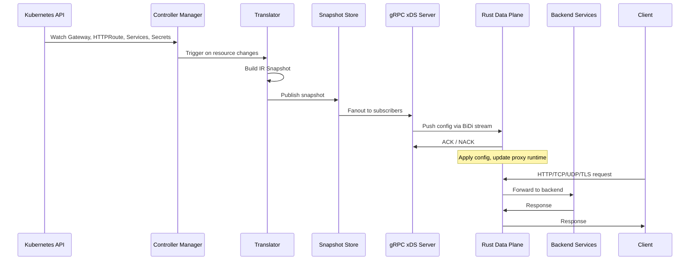
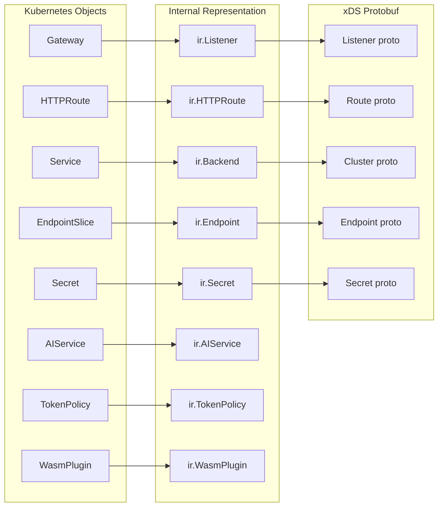

Nantian Gateway uses a split-plane architecture. A Go control plane watches the Kubernetes API for Gateway resources, translates them into a device-independent internal representation, and pushes configuration snapshots to Rust data plane proxies over gRPC/xDS bidirectional streams. The two planes are deployed as separate Kubernetes workloads, scaled independently, and communicate exclusively through the gRPC channel.

This separation means the control plane can evolve quickly in Go's rich Kubernetes ecosystem while the data plane runs a fast, memory-safe Rust proxy that handles every byte of request traffic.

## Data flow

The diagram below traces a complete cycle from Kubernetes resource creation to traffic serving:



## Planes at a glance

**Control plane** (Go, `gateway/cmd/manager/main.go`): Watches Kubernetes resources, translates them into the Internal Representation (IR), publishes snapshots through the snapshot store, and serves the Admin API. It runs the controller-runtime manager, the gRPC xDS server, and the reconciler runner. Leader election ensures only one control plane instance drives translation at a time, but multiple replicas can be deployed for high availability.

**Data plane** (Rust, `dataplane/`): Receives configuration via xDS, applies it to the proxy runtime, and handles all request traffic. It implements HTTP routing, stream (TCP/UDP) proxying, TLS termination, rate limiting, circuit breaking, and Wasm plugin execution. Each data plane instance connects to the control plane independently and maintains its own configuration stream.

**Communication**: The control plane implements the `ConfigurationDiscoveryService` gRPC service defined in `proto/gateway/control/v1/`. Data planes open a bidirectional stream, receive full configuration snapshots on initial connection, then receive delta updates as the control plane rebuilds the IR. The data plane also sends status reports back over the same stream, giving the control plane visibility into proxy health and configuration state.

## Internal representation

The IR is the bridge between the Kubernetes-native Gateway API and the device-independent xDS protocol. The translator reads Kubernetes objects and produces an `ir.Snapshot` struct containing typed listeners, routes, backends, and secrets. The snapshot store then fans this out to the gRPC server, which serializes it into protobuf and streams it to connected data planes.



## Key packages

The control plane is organized into these packages under `gateway/internal/`:

| Package | Responsibility |
|---------|---------------|
| `translator/` | Reads Kubernetes objects, builds IR snapshots |
| `ir/` | Internal representation types and snapshot store |
| `grpcserver/` | gRPC xDS server, stream management, snapshot fanout |
| `admin/` | HTTP admin API server, dashboard backend |
| `controller/` | Reconciler runner, snapshot sync controller |
| `status/` | Writes status back to Gateway API resources |
| `nodestatus/` | Node status registry and Kubernetes lease persistence |
| `lifecycle/` | Component supervisor, startup gate, graceful shutdown |
| `infrastructure/` | Infrastructure reconciler, node-aware backend resolution |
| `gatewayapi/` | Gateway API resource controllers |
| `gatewayapiexperimental/` | Custom CRD types (AIService, TokenPolicy, WasmPlugin, BackendLBPolicy) |
| `config/` | Configuration loading, validation, defaults |
| `observability/` | Prometheus metrics definitions and HTTP handler |
## Deployment topology

In a typical production deployment, the split-plane architecture looks like this:

```
+--------------------------------------------------+

|  Kubernetes Cluster                               |
|                                                   |
|  +---------------------------+  +--------------+  |
|  |  Control Plane (2 replicas)|  | Dashboard    |  |
|  |  Leader-elected           |  | (1 replica)  |  |
|  |  - Watches API            |  +--------------+  |
|  |  - Translates to IR       |                    |
|  |  - Serves Admin API       |                    |
|  |  - Serves gRPC xDS (:18080)|                   |
|  +------------+--------------+                    |
|               |                                    |
|               | gRPC/xDS                           |
|               |                                    |
|  +------------v--------------+                    |
|  |  Data Plane (2+ replicas) |                    |
|  |  - HTTP proxy             |                    |
|  |  - Stream proxy (TCP/UDP) |                    |
|  |  - TLS termination        |                    |
|  |  - Wasm runtime           |                    |
|  +------------+--------------+                    |
|               |                                    |
|               | HTTP/TCP/UDP                       |
|               |                                    |
|  +------------v--------------+                    |
|  |  Backend Services         |                    |
|  +---------------------------+                    |
+--------------------------------------------------+
```

## Scaling

The two planes scale independently. The control plane is typically deployed with two replicas for high availability, with leader election ensuring only one translates at a time. The data plane scales horizontally with your traffic: add more replicas as request volume grows, and each replica independently connects to the control plane and receives the same configuration snapshot.

The control plane's translation workload is proportional to the number of Gateway API resources, not the number of data plane replicas. Adding more data plane replicas increases gRPC fanout on the control plane but does not increase translation cost.

:::note
The control plane leader handles all translation and gRPC streaming. The standby replica is ready to take over if the leader fails. The standby replica also serves the Admin API and metrics endpoint, so dashboards and health checks stay available during leader transitions.
:::

## What's next

- [Control Plane Design](/architecture/controlplane) -- deep dive into the translator, reconciler, and xDS server
- [Data Plane Design](/architecture/dataplane) -- how the Rust proxy routes traffic and applies configuration
- [Admin API](/architecture/admin-api) -- API reference for the built-in admin and dashboard server