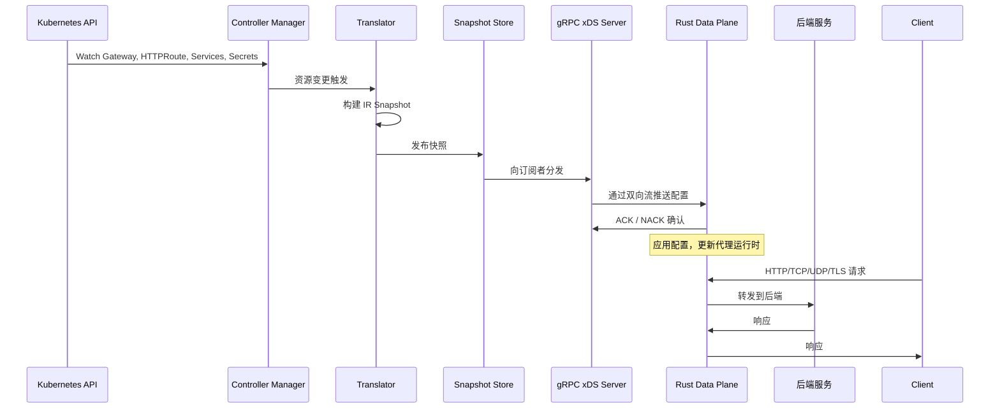
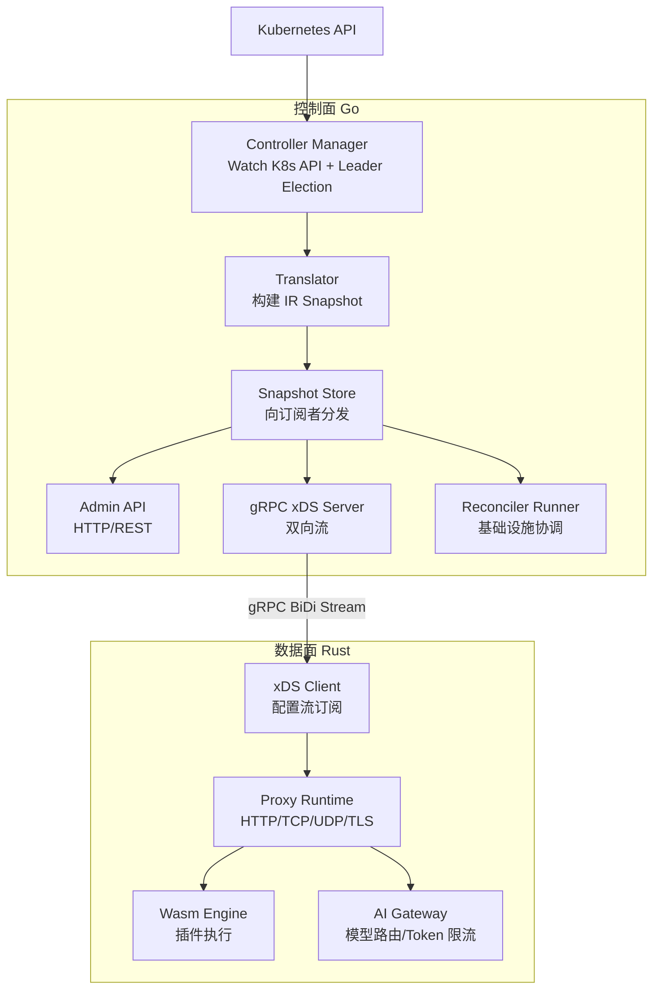

Nantian Gateway 采用控制面与数据面分离的架构（split-plane architecture）。Go 控制面监听 Kubernetes API 中的 Gateway 资源，将其翻译为与设备无关的内部表示（IR），然后通过 gRPC/xDS 双向流推送到 Rust 数据面代理。两个平面以独立的 Kubernetes 工作负载部署，各自扩缩，彼此之间仅通过 gRPC 通道通信。

这种分离意味着控制面可以借助 Go 在 Kubernetes 生态中的丰富库快速演进，而数据面则运行一个快速、内存安全的 Rust 代理，处理每一字节的请求流量。

## 设计哲学

Nantian Gateway 的架构建立在一组经过验证的原则之上，每条原则都回答了"为什么这样做"的问题。

**控制面与数据面分离**：数据面专注于低延迟、高吞吐量的请求处理，不受 Kubernetes API 交互的干扰。控制面可以自由使用 Go 的 Kubernetes 客户端库，不担心对请求路径的性能影响。两个平面独立扩缩：流量激增时只扩展数据面，Gateway 资源数量增长时只扩展控制面。故障域也天然隔离，数据面的 bug 不会影响配置管理，控制面的故障不会中断现有流量。

**Go + Rust 双语言选择**：Go 在 Kubernetes 生态中拥有最成熟的客户端库和控制器模式（controller-runtime），适合构建控制面的 Watch、Reconcile、Leader Election 等逻辑。Rust 提供零成本抽象、无 GC 停顿和编译期内存安全，适合处理数据面的每请求路径。选择两种语言各司其职，而不是在单一语言中妥协。

**xDS 协议**：xDS 是 Envoy 使用的配置分发协议，经过大规模生产环境验证。Nantian Gateway 复用了 xDS 的双向流模型：控制面主动推送配置快照，数据面确认接收并报告状态。这种推送模型比轮询更高效，天然支持增量更新（delta xDS）和配置版本追踪，也使得 Nantian Gateway 的数据面理论上可以兼容任何支持 xDS 的控制面。

**Gateway API 原生**：Nantian Gateway 直接消费 Kubernetes Gateway API 资源（Gateway、HTTPRoute、GRPCRoute 等），不做额外的 CRD 包装。这意味着用户可以直接使用标准 Gateway API 工具链和生态，无需学习额外的 API 语法。

## 数据流转

下图展示了一个完整的周期，从 Kubernetes 资源创建到流量服务：

## 两个平面一览

**控制面**（Go，`gateway/cmd/manager/main.go`）：监听 Kubernetes 资源，将其翻译为内部表示（IR），通过快照存储发布配置，并提供 Admin API。它运行 controller-runtime 管理器、gRPC xDS 服务器和 reconciler runner。主从选举确保同一时刻只有一个控制面实例驱动翻译，但可以部署多个副本以实现高可用。

**数据面**（Rust，`dataplane/`）：通过 xDS 接收配置，将其应用到代理运行时，并处理所有请求流量。它实现了 HTTP 路由、流代理（TCP/UDP）、TLS 终结、限流、熔断和 Wasm 插件执行。数据面还暴露了自己的 Admin API 和 Prometheus 指标端点。

## 控制面内部架构

控制面内部由一条四阶段流水线构成，确保从 Kubernetes 资源到数据面配置的转换是确定性的、可追踪的。

**Controller Manager** 是流水线的入口。它通过 controller-runtime 的 Informer 机制 Watch Gateway、HTTPRoute、Service、EndpointSlice、Secret、以及 Nantian Gateway 扩展的 AIService、TokenPolicy、WasmPlugin 等资源。当任意被监听的资源发生变更时，Controller Manager 触发一次翻译循环。

**Translator** 接收变更事件，从所有 Informer 缓存中读取最新的资源状态，构建一个完整的 IR Snapshot。Translator 负责解决跨资源引用（例如 HTTPRoute 引用的 BackendRef 需要从 Service 和 EndpointSlice 中解析出实际的端点地址）、执行策略合并（例如多个 TokenPolicy 作用于同一个路由时的优先级排序）、以及验证配置合法性。如果翻译过程中发现不可恢复的错误，Translator 会生成一个包含部分有效配置的快照，避免因单个资源配置错误导致整个数据面断流。

**Snapshot Store** 是控制面的配置分发中枢。它持有当前最新的 IR Snapshot，并通过发布-订阅模式向三个消费者分发：Admin API 提供只读查询（用于 Dashboard 展示和运维诊断），gRPC xDS Server 推送到数据面，Reconciler Runner 驱动基础设施协调（例如创建负载均衡器、配置 DNS 等）。

**gRPC xDS Server** 实现了 `ConfigurationDiscoveryService` 服务（定义在 `proto/gateway/control/v1/`）。数据面打开双向流后，Server 首先推送完整的配置快照，后续在 Snapshot Store 每次更新时推送增量变更。数据面通过 ACK/NACK 机制确认配置接收和应用状态，Server 据此更新每台数据面的配置版本和健康状态。

## 数据面内部架构

数据面内部同样采用分层架构，将配置同步、运行时执行和扩展能力解耦。

**xDS Client** 通过双向 gRPC 流订阅控制面的配置更新。首次连接时接收完整快照，后续接收增量变更。xDS Client 负责版本校验、ACK/NACK 反馈，以及连接断开后的自动重连和重同步。每个数据面实例独立维护自己的配置流，不存在共享状态。

**Config Cache** 在内存中缓存反序列化后的配置对象。它是 xDS Client 和 Proxy Runtime 之间的缓冲层：xDS Client 写入新配置，Proxy Runtime 以原子方式切换到新配置，避免请求处理过程中出现配置不一致。缓存支持旧版本的保留，以便在配置回滚时快速切换。

**Proxy Runtime** 是数据面的核心请求处理引擎。它构建了一条完整的过滤器链（Filter Chain），每个请求依次经过：TLS/HTTP 协议解析、路由匹配、限流检查、熔断判断、负载均衡、请求转发。Proxy Runtime 使用 async Rust（tokio 运行时）处理并发连接，每个连接作为一个独立的异步任务调度，充分利用多核 CPU。

**Wasm Engine** 嵌入在过滤器链中，允许用户在特定位置注入自定义逻辑。Wasm 插件可以访问请求/响应头、Body 内容、以及连接元数据，用于实现认证、日志采集、请求变换等扩展功能。引擎采用 Wasmtime 作为运行时，支持与 Proxy Runtime 共享内存以降低插件调用的序列化开销。

**AI Gateway** 模块位于 Proxy Runtime 的上层，专门处理 AI API 请求（LLM 调用、Embedding、向量搜索等）。它实现模型路由（根据请求参数选择目标模型）、Token 限流（按 Token 维度控制消费速率）、请求/响应变换（统一不同 LLM 提供商的 API 格式）等功能。AI Gateway 的配置同样通过 xDS 下发，与普通 HTTP 路由共享同一套配置分发体系。

## IR（中间表示）详解

IR 是控制面和数据面之间的契约，也是 Nantian Gateway 架构中最核心的抽象层。它不是 Kubernetes 资源的简单拷贝，而是一个经过翻译、去重和优化的配置视图。

一个完整的 `ir.Snapshot` 包含以下字段：

- **Listeners**：由 Gateway 资源生成，包含监听端口、协议（HTTP/HTTPS/TCP/UDP）、TLS 配置和关联的路由列表
- **HTTPRoutes**：由 HTTPRoute/GRPCRoute 资源生成，包含路径匹配规则、Header 匹配规则、重写规则、超时配置、重试策略和关联的后端引用
- **Backends**：由 Service 资源生成，包含负载均衡策略（轮询/最少连接/一致性哈希）、健康检查配置和熔断参数
- **Endpoints**：由 EndpointSlice 资源生成，包含后端 Pod 的实际 IP 地址和端口
- **Secrets**：由 Secret 资源生成，包含 TLS 证书、密钥和 CA 证书
- **AIServices**：Nantian Gateway 扩展，描述 AI 模型服务的端点、能力（支持的模型列表）和认证方式
- **TokenPolicies**：Nantian Gateway 扩展，描述 Token 维度的限流策略，包括令牌桶参数和策略生效范围
- **WasmPlugins**：Nantian Gateway 扩展，描述 Wasm 插件的加载方式（本地文件/OCI 镜像）、执行阶段（请求头/请求体/响应头/响应体）和配置参数

IR 的存在使得控制面可以专注于"翻译"（Kubernetes 语义到配置语义），数据面可以专注于"执行"（配置到请求处理），两者之间通过 IR 解耦。这也意味着更换数据面实现（例如从自研 Rust 代理切换到 Envoy）只需要修改 xDS 序列化层，控制面逻辑完全不需要改动。

IR 到 xDS 的映射关系如下：Listener → LDS（Listener Discovery Service），HTTPRoute → RDS（Route Discovery Service），Backend → CDS（Cluster Discovery Service），Endpoint → EDS（Endpoint Discovery Service），Secret → SDS（Secret Discovery Service）。AIService、TokenPolicy 和 WasmPlugin 作为 Nantian Gateway 的扩展资源类型，通过自定义 xDS 扩展字段传输。

## 组件交互

## 扩展点

Nantian Gateway 提供了三个层次的扩展能力，用户可以根据需求选择合适的集成深度。

**Wasm 插件**：适合请求/响应级别的逻辑扩展。用户可以编写 Wasm 模块（支持 Rust、Go、C 等语言编译到 Wasm），通过 WasmPlugin 资源声明加载和执行阶段。Wasm 插件在 Proxy Runtime 的过滤器链中运行，可以访问和修改请求头、Body、Trailers，但不能改变路由决策。插件通过 OCI 镜像分发，支持版本管理和灰度发布。

**自定义过滤器**：适合需要更深层控制的扩展场景。如果 Wasm 的性能开销不可接受，或者需要访问代理运行时内部状态（例如连接池指标、熔断器状态），用户可以实现 Rust trait 并以编译期插件的方式集成到数据面中。这种方式需要重新编译数据面镜像，但可以获得与内置过滤器同等的性能。

**AI Gateway 集成**：AI Gateway 模块本身就是一个扩展点。用户可以实现自定义的模型路由器（根据流量特征动态选择模型）和 Token 限流器（支持更复杂的限流算法）。这些扩展通过 Rust trait 定义接口，在编译期链接。

## 性能特征

Nantian Gateway 的数据面用 Rust 编写，目标是在不牺牲功能的前提下提供接近线速的代理性能。

**吞吐量**：在典型的 HTTP 代理场景下（16 核，64B Body），单实例 Rust 数据面可以处理约 50 万 QPS。启用 Wasm 插件后，根据插件复杂度的不同，吞吐量会有 5% 到 20% 的下降。AI Gateway 路径的吞吐量受下游 LLM 提供商响应速度主导，代理本身的额外开销在 1ms 以内。

**延迟**：P50 代理延迟（不含后端响应时间）低于 0.5ms，P99 低于 2ms。xDS 配置应用延迟（从控制面推送快照到数据面完成热切换）通常在 100ms 以内。

**内存**：基线内存占用约 50MB（不含连接缓冲区）。每个活跃连接额外占用约 2KB 的缓冲区内存。Wasm 引擎根据加载的插件模块数量额外占用 5MB 到 50MB。

**扩展性**：控制面单个实例可以管理约 1 万个 Gateway 资源和 10 万个路由规则，完整翻译一个快照通常在 200ms 以内。数据面实例数量不受控制面限制，每个实例独立连接，支持水平扩展到数百个节点。

:::tip
阅读[控制面设计](./controlplane)和[数据面设计](./dataplane)了解每个平面的详细内部结构。
:::
